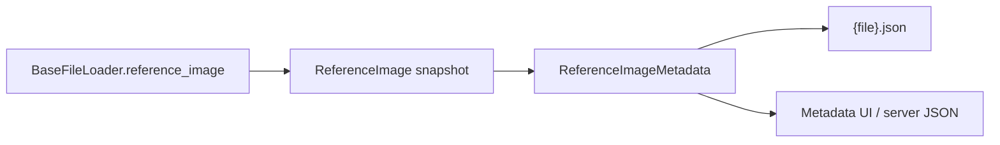

# 057 — Reference image metadata in AcqImage (handoff / plan)

**Branch context:** follow-on to `056` on `debug/oir-units-and-reference` after
reference `coord_scales` fix lands.

**Goal:** When a file has a reference/overview image, expose a small,
schema-driven metadata section on `AcqImage` and persist it in the sidecar JSON
alongside `image_header_metadata`.

---

## Problem

Today reference calibration lives only inside `ReferenceImage.coord_scales` /
`ReferenceImagePlane.dx`/`dy` at runtime. It is not:

- listed in `AcqImage.get_metadata_sections()`
- serialized in `{file}.json` sidecars
- visible in metadata UIs or server open JSON

Primary kymograph header metadata correctly uses **seconds / µm** on Y/X.
Reference images are **spatial 2-D** — both axes should be **µm** with equal
µm/px step (after the 056 reference scale fix).

Olympus TXT `[Reference Image]` is the external SoT for reference field size
when TIF exports omit reference pixels.

---

## Proposed sidecar shape

Optional top-level key (absent when no reference):

```json
"reference_image_metadata": {
  "dtype": "uint16",
  "num_channels": 1,
  "physical_label_x": "um",
  "physical_label_y": "um",
  "physical_unit_x": 0.331456303681194,
  "physical_unit_y": 0.331456303681194,
  "shape": "(512, 512)",
  "sizes": "{'Y': 512, 'X': 512}"
}
```

**Omit** primary-only fields: `date`, `time`, `num_scenes`, `dims` string
(unless we want `dims: "('Y', 'X')"` for symmetry — recommend **include**
`dims` for consistency with primary header).

**Sidecar version:** keep `_ACQIMAGE_SIDECAR_VERSION = 2`. Add
`reference_image_metadata` to `_ACQIMAGE_SIDECAR_OPTIONAL_KEYS` (like
`image_contrast`). Old sidecars load unchanged; new saves include the key when
present.

---

## Proposed schema (`metadata.py`)

New `REFERENCE_IMAGE_METADATA_SCHEMA` and `ReferenceImageMetadata` class,
mirroring `ImageHeaderMetadata` but smaller:

| Field | Editable | Notes |
|-------|----------|-------|
| `shape` | no | `str(tuple)` |
| `dims` | no | `str(tuple)` — expect `('Y', 'X')` |
| `sizes` | no | `str(dict)` |
| `dtype` | no | from reference array |
| `num_channels` | no | |
| `physical_unit_y` | **TBD** | default **read-only** v1 |
| `physical_unit_x` | **TBD** | default **read-only** v1 |
| `physical_label_y` | **TBD** | default `"um"` |
| `physical_label_x` | **TBD** | default `"um"` |

`metadata_section_id`: `'reference_image_metadata'` (matches sidecar key).

**v1 recommendation:** all fields read-only (file-derived). Reference
calibration is rarely user-edited; editable units can be a follow-up if needed.

---

## Data flow



### Build from `ReferenceImage` (single helper)

Add e.g. `reference_image_metadata_from_snapshot(ref: ReferenceImage) -> dict`
in `metadata.py` or `base_file_loader.py`:

1. `plane = ref.get_plane(channel=0)` for display dtype/shape if needed, or
   derive shape from `ref.array` + `ref.dims` (prefer snapshot fields, not
   decoded full array when `load_images=False`).
2. `physical_unit_y` ← `ref._scale_for_dim("Y")` (or plane.dx — note existing
   `ReferenceImagePlane` swaps dx↔Y, dy↔X; **use `ReferenceImage` scale
   helpers**, not plane field names, when populating metadata).
3. Labels: coerce to `"um"` for OIR/CZI reference; read from
   `ref.coord_units` when trustworthy.
4. `num_channels` ← `ref.num_channels`.

### `AcqImage` lifecycle

1. On init, if `self._images.has_reference_image`:
   - Lazy: build metadata on first `get_metadata_section('reference_image_metadata')`
   - **Or** eager: build once when `reference_image` is first accessed
2. `_build_sidecar_payload`: include
   `'reference_image_metadata': section.get_values()` when section exists
3. `_apply_loaded_sidecar_payload`: if key present and file still has
   reference, `apply_sidecar_*` (likely read-only → ignore patch v1); if key
   absent, rebuild from loader
4. `get_metadata_sections()`: return
   `(experiment, image_header)` or `(experiment, image_header, reference)` —
   **dynamic tuple length** (update `test_file_loader_factory` assertion)

When `has_reference_image` is false, omit key on save and return two sections.

---

## Files to touch (implementation ticket)

| File | Change |
|------|--------|
| `src/acqstore/acq_image/metadata.py` | `REFERENCE_IMAGE_METADATA_SCHEMA`, `ReferenceImageMetadata` |
| `src/acqstore/acq_image/acq_image.py` | section instance, sidecar R/W, `get_metadata_sections()` |
| `src/acqstore/acq_image/file_loaders/base_file_loader.py` | optional `reference_header_from_snapshot()` helper |
| `src/acqstore/acq_image/file_loaders/oir_file_loader.py` | no scale change; may export label coercion |
| `src/acqstore/acq_image/file_loaders/czi_file_loader.py` | ensure CZI reference populates same metadata shape |
| `tests/acqstore/test_acq_image_sidecar.py` | round-trip `reference_image_metadata` |
| `tests/acqstore/test_metadata.py` | schema validation |
| `tests/acqstore/test_file_loader_factory.py` | dynamic section count |
| `tests/acqstore/test_oir_file_loader.py` | metadata values vs plane scales |

**Out of scope v1 (optional follow-ups):**

- CloudScope `reference_image_metadata_view.py` (new widget)
- `acqstore_server` open JSON field
- Editable reference calibration in GUI
- `scripts/acqstore/debug_oir_loader.py`

---

## Loader-specific notes

### OIR

After 056, `ReferenceImage.coord_scales` already carry µm/px on Y/X. Metadata
builder should read scales from the snapshot, not re-parse Olympus TXT.

### CZI

`czi_file_loader._reference_pixel_size_um_from_czi` already supplies scaling;
metadata should match `ReferenceImage` built there.

### TIF / other

No reference → no section, no sidecar key.

---

## Test plan

1. **Unit:** `ReferenceImageMetadata.get_values()` from synthetic `ReferenceImage`.
2. **OIR integration:** load `tmp/oir-debug/.../0010.oir` with
   `load_images=False`; assert metadata `physical_unit_x ≈ primary X ≈ 169.706/512`.
3. **Sidecar:** save/load round-trip preserves `reference_image_metadata`.
4. **Regression:** files without reference — sidecar unchanged, two metadata sections.
5. **CZI:** one fixture with reference (if present in `tests/.../data`).

```bash
uv run pytest tests/acqstore/test_acq_image_sidecar.py tests/acqstore/test_metadata.py tests/acqstore/test_oir_file_loader.py -q
```

---

## Open decisions (confirm before implementation)

1. **Include `dims` in reference metadata?** Recommended yes.
2. **Editable physical units in v1?** Recommended no (read-only).
3. **Lazy vs eager metadata build** when `load_images=False` — lazy avoids
   decoding reference array; `has_reference_image` + header-only snapshot may
   suffice if we can read shape/dtype from `oirfile.reference` without full
   `asarray()` (check perf on large refs).

---

## Acceptance criteria

- `AcqImage.get_metadata_section('reference_image_metadata')` works when
  `has_reference_image`.
- Sidecar save/load round-trips the subset fields.
- OIR reference `physical_unit_x/y` match corrected `ReferenceImage` scales.
- No change to primary `image_header_metadata` behavior.
