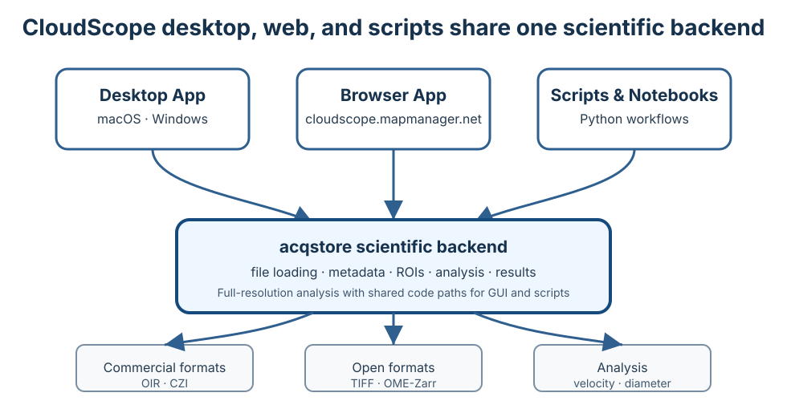

---
hide:
  - toc
---

# CloudScope

CloudScope is a scientific image loading, visualization, and analysis application.

It provides desktop and browser interfaces for working with acquisition-backed image data. Current quantitative analysis workflows are designed for **line scan kymographs** and include:

- blood flow velocity analysis from line scan kymographs using a Radon-transform-based method
- vessel diameter analysis from line scan kymographs

The same `acqstore` scientific backend is used by the desktop application, browser application, Python scripts, and Jupyter notebooks.

-   :material-web:{ .lg .middle } **Launch the web app**

    ---

    Try CloudScope in your browser before installing a desktop build.

    [:octicons-arrow-right-24: Open cloudscope.mapmanager.net](https://cloudscope.mapmanager.net){target="_blank" rel="noopener"}

-   :material-download:{ .lg .middle } **Download the desktop app**

    ---

    CloudScope desktop is the same application on macOS and Windows. Choose the build for your operating system from GitHub Releases.

    [:material-apple: macOS](https://github.com/mapmanager/cloudscope/releases){target="_blank" rel="noopener"} · [:material-microsoft-windows: Windows](https://github.com/mapmanager/cloudscope/releases){target="_blank" rel="noopener"}

## Why CloudScope?

CloudScope separates scientific data handling from user interfaces. The desktop GUI, browser GUI, notebooks, and scripts all use the same backend code for loading files, managing ROIs, running analysis, and saving results.

This architecture helps keep analysis behavior reproducible across interfaces and makes it possible to validate scientific workflows with unit tests and versioned releases.

## One backend, multiple interfaces

{ .cs-screenshot .cs-screenshot-center width="760" loading=lazy }

CloudScope is built around `acqstore`, the shared scientific backend. The GUI is a user interface for the same backend APIs that can also be called directly from Python.

## Supported file formats

CloudScope currently supports commercial microscopy formats and open scientific image formats, including:

- Olympus / Evident `.oir`
- Zeiss `.czi`
- TIFF `.tif`
- OME-Zarr `.ome.zarr`

Support for commercial microscopy formats builds on the scientific Python ecosystem. CloudScope gratefully acknowledges [Christoph Gohlke](https://www.cgohlke.com/){target="_blank" rel="noopener"} for long-standing work on microscopy and scientific file-format tooling.

## Who is this documentation for?

-   :material-account:{ .lg .middle } **End User**

    ---

    Install the desktop app, open the web app, load data, run analysis, inspect images, and export results.

    [:octicons-arrow-right-24: End User Guide](users/index.md)

-   :material-flask:{ .lg .middle } **Data Scientist**

    ---

    Understand `AcqImage`, `AcqImageList`, line scan kymograph analysis, saved files, metadata, and notebook workflows.

    [:octicons-arrow-right-24: Data Scientist Guide](scientists/index.md)

-   :material-code-braces:{ .lg .middle } **Developer**

    ---

    Clone the repository, run tests, build docs, understand the architecture, and follow the release/deployment workflow.

    [:octicons-arrow-right-24: Developer Guide](developers/index.md)

