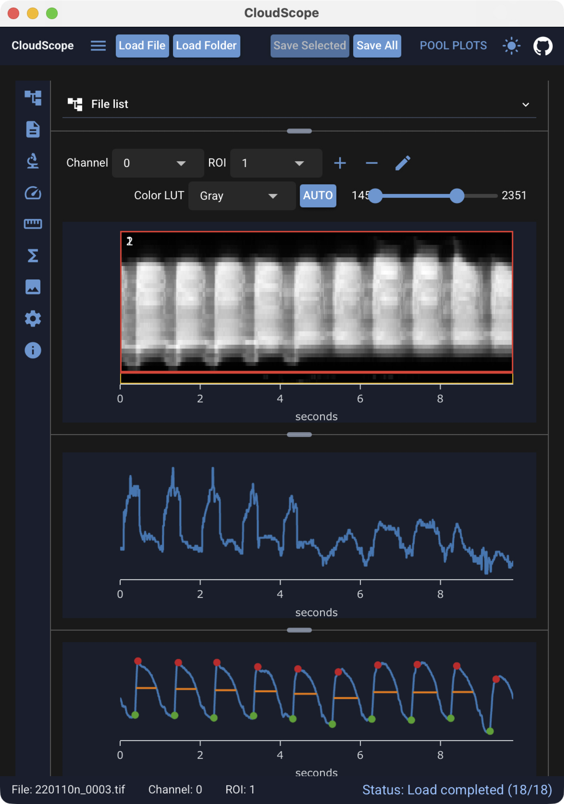

---
hide:
  - toc
---

# CloudScope

{ .cs-screenshot width="600" align=right loading=lazy }

CloudScope is an image loading, visualization, and analysis application.

It provides desktop and browser interfaces for working with acquisition-backed image data. Current quantitative analysis workflows are designed for **line scan kymographs** and include:

- [*in vivo* blood flow velocity analysis](users/recipes/velocity-analysis.md) using a Radon-transform-based method
- [vessel diameter analysis](users/recipes/diameter-analysis.md)
- [peak detection](users/recipes/sum-intensity-analysis.md) for functional fluorescence reporters (like GCaMP)

For folder-level comparison of analysis results across many files, CloudScope provides **pool plots** — interactive velocity and peak summaries that update as you load data and run analyses. See the [Pool plots](users/pool-plots.md) guide.

New to the interface? Start with [Using the GUI](users/gui.md) — load sample data from the [top header](users/gui.md#top-header-and-loadsave-controls), select files and ROIs, and run analyses from the left toolbar.

-   :material-web:{ .lg .middle } **Launch the web app**

    ---

    Try CloudScope in your browser before installing a desktop build.

    [:octicons-arrow-right-24: Open cloudscope.mapmanager.net](https://cloudscope.mapmanager.net){target="_blank" rel="noopener"}

-   :material-download:{ .lg .middle } **Download the desktop app**

    ---

    CloudScope desktop is the same application on macOS and Windows. Step-by-step install instructions for each platform are in the documentation.

    [:octicons-arrow-right-24: Install the desktop app](users/install.md)

## Why CloudScope?

CloudScope separates data handling from user interfaces. The desktop and browser GUIs, notebooks, and scripts all use the same backend code for loading files, managing ROIs, running analysis, and saving results.

This architecture helps keep analysis behavior reproducible across interfaces and makes it possible to validate workflows with unit tests and versioned releases.

## One backend, multiple interfaces

{ .cs-screenshot .cs-screenshot-center width="760" loading=lazy }

CloudScope is built around a shared scientific backend. The GUI is a user interface for the same analysis code that can also be called directly from Python notebooks and scripts — so a measurement run in the app can be reproduced and extended in code without reimplementing the algorithm.

## Supported file formats

CloudScope supports these **commercial microscopy formats**:

- Olympus / Evident `.oir`
- Zeiss `.czi`
- Nikon `.nd2`

and these **open image formats**:

- TIFF `.tif`
- OME-Zarr `.ome.zarr`

See [Supported file formats](users/supported-file-formats.md) for format-specific notes.

Support for commercial microscopy formats builds on the Python imaging ecosystem. CloudScope gratefully acknowledges [Christoph Gohlke](https://www.cgohlke.com/){target="_blank" rel="noopener"} for long-standing work on microscopy and file-format tooling.

## Who is this documentation for?

-   :material-account:{ .lg .middle } **End User**

    ---

    Install the desktop app, open the web app, load data, run analysis, visualize images, and export results.

    [:octicons-arrow-right-24: End User Guide](users/index.md)

-   :material-flask:{ .lg .middle } **Data Scientist**

    ---

    Understand `AcqImage`, `AcqImageList`, line scan kymograph analysis, saved files, metadata, and notebook workflows.

    [:octicons-arrow-right-24: Data Scientist Guide](scientists/index.md)

-   :material-code-braces:{ .lg .middle } **Developer**

    ---

    Clone the repository, run tests, build docs, understand the architecture, and follow the release/deployment workflow.

    [:octicons-arrow-right-24: Developer Guide](developers/index.md)

