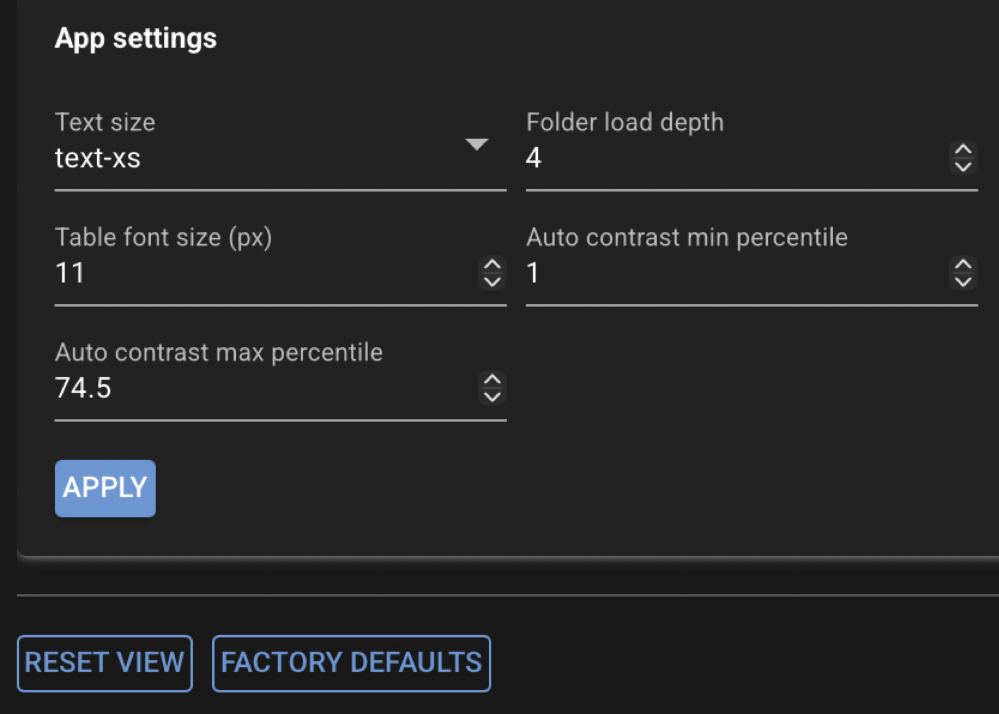

# GUI: App config

Open the left navigation toolbar and click **Config** (settings icon) to change persisted
application settings. These values apply across the current CloudScope session and future
launches on the same machine or browser profile.

{ .cs-screenshot .cs-screenshot-center width="640" loading=lazy }

## Settings

Edit values in the settings card and click **Apply** to save. Settings are written to the
CloudScope app configuration file on disk.

| Setting | Description |
|---|---|
| **Text size** | Default Tailwind text size class for NiceGUI widgets across the app (labels, buttons, and general UI text). |
| **Folder load depth** | Maximum directory depth when loading a folder (must be ≥ 1). Controls how many levels deep CloudScope searches for supported image files during a **Load Folder** operation. |
| **Table font size (px)** | Font size in pixels for file-list tree cells and column headers (main workspace file list and left-toolbar **File List** panel). |
| **Auto contrast min percentile** | Lower **NumPy percentile** bound used when you click **Auto** on the image toolbar and when CloudScope seeds initial display contrast for a channel. **Display only** — does not affect analysis inputs or saved analysis results. |
| **Auto contrast max percentile** | Upper **NumPy percentile** bound for **Auto** contrast and initial contrast seeding. **Display only** — does not affect analysis. |

The auto-contrast percentiles define which pixel intensity range is mapped to the visible colormap
(for example clipping at the 2nd and 98th percentile of the current image plane). Analysis always
uses full-resolution source data from `acqstore`, independent of these display settings.

## Additional actions

- **Reset View** — reset Home page splitter layout to the default arrangement (does not change
  the settings above).
- **Factory defaults** — restore the editable settings on this panel to factory defaults.

## See also

- [Using the GUI](gui.md) — image toolbar **Auto** contrast and file-list appearance
- [Saved file formats](saved-files.md)
