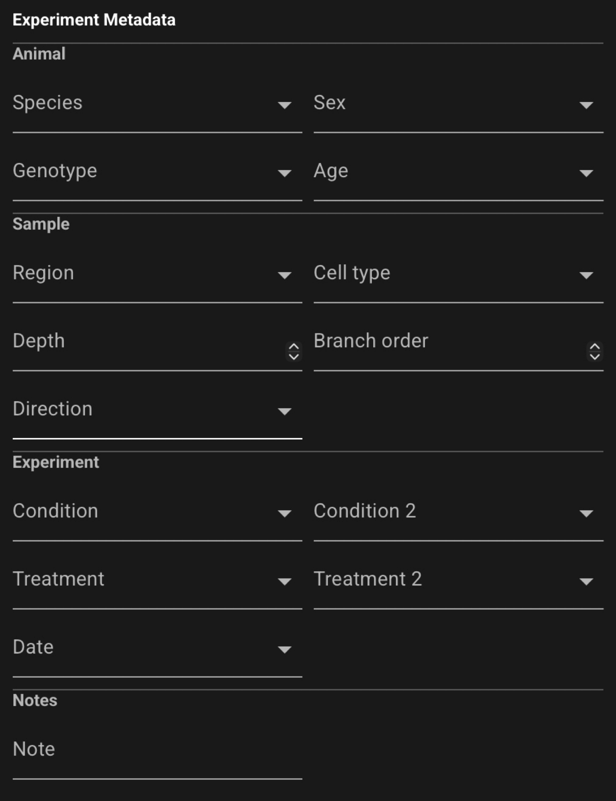

# GUI: Experiment metadata

Open the left navigation toolbar and click **Experimental Metadata** (description icon) to edit
experiment fields for the **currently selected file**.

{ .cs-screenshot .cs-screenshot-center width="640" loading=lazy }

Experimental metadata describes the biological sample, experimental condition, notes, and related
fields you associate with an acquisition. Edits update the in-memory file immediately; use **Save
Selected** or **Save All** in the top header to write changes to disk.

## How editing works

- **Immediate apply** — each field commits as you edit it. There is no separate **Apply** or
  **Commit** button for the form. When you change a value and leave the field (or press Enter),
  CloudScope applies that field to the selected file right away.
- **Preset dropdowns** — categorical text fields such as **Sex**, **Genotype**, **Condition**, and
  similar columns show a dropdown of values already used by other files in the **currently loaded
  folder**. Pick an existing value for consistency across a dataset.
- **Custom values** — you can type a new value instead of choosing from the dropdown. New text is
  accepted like any other field value.

## Typical workflow

1. Select a file in the file list.
2. Open **Experimental Metadata** on the left toolbar.
3. Edit fields in the form (changes apply per field as you commit each one).
4. Save from the top header when the file shows unsaved changes.

If no file is selected, the panel prompts you to select a file first.

## Field reference

Experimental metadata fields are defined in the CloudScope schema. Common fields include **Species**,
**Sex**, **Genotype**, **Region**, **Condition**, and free-text **Note**. The exact set of fields
may evolve between releases.

For the full field list and schema detail, see [AcqImage Metadata](../scientists/acqimage-metadata.md#experimental-metadata).

## See also

- [Using the GUI](gui.md)
- [GUI: Image header](gui-image-header.md)
- [Saved file formats](saved-files.md)
