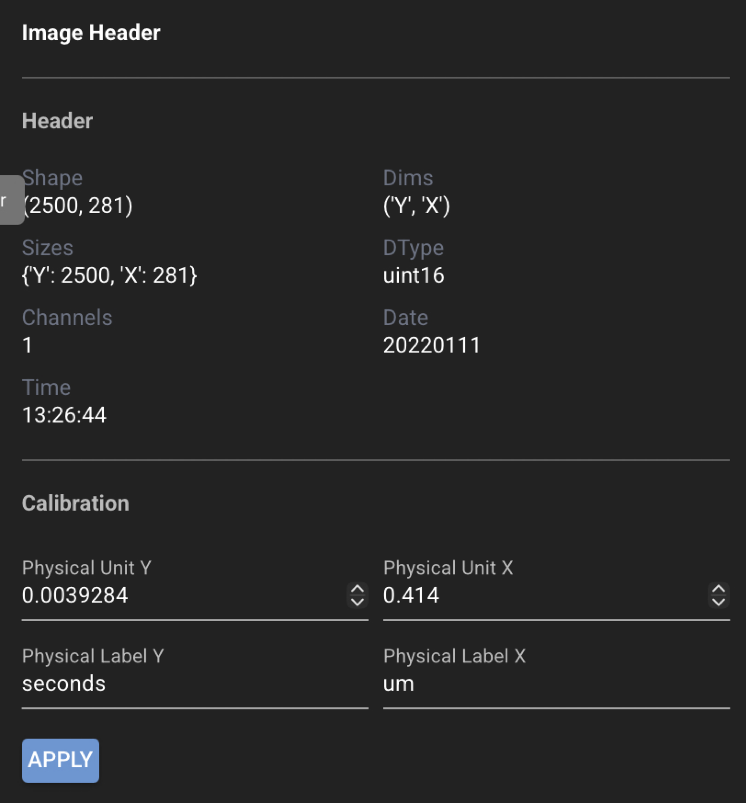

# GUI: Image header

Open the left navigation toolbar and click **Image Header** (biotech icon) to view header
metadata read from the source file and to set **physical units** and axis labels used for
measurements and plots.

{ .cs-screenshot .cs-screenshot-center width="640" loading=lazy }

Image header metadata comes from the file format when available (for example Olympus `.oir` or
Zeiss `.czi`).

## Read-only vs editable fields

**Most header fields are view-only.** They reflect what CloudScope read from the file (dimensions,
format-specific metadata, and related loader output). You cannot edit those values in the GUI.

**Editable calibration fields** are limited to Y/X **physical unit** size and **physical unit
labels**. Use these when a file lacks embedded scaling — for example a plain **`.tif`** with no
physical units — so analyses and plots can still report measurements in real units. After editing,
click **Apply** on the header card, then **Save Selected** or **Save All** in the top header.

Physical units affect ROI measurements, plot axis scaling, and analysis outputs that report
values in real units. They do not change the underlying pixel data.

## Typical workflow

1. Select a file in the file list.
2. Open **Image Header** on the left toolbar.
3. Review read-only header fields.
4. If needed, adjust **physical unit** and **label** fields for the Y and X axes.
5. Click **Apply** on the header card when you changed calibration fields.
6. Save from the top header when the file shows unsaved changes.

## Field reference

Header fields are defined in the CloudScope schema. For the full field list and schema detail, see
[AcqImage Metadata](../scientists/acqimage-metadata.md#image-header-metadata).

## See also

- [Using the GUI](gui.md)
- [GUI: Experiment metadata](gui-experiment-metadata.md)
- [Saved file formats](saved-files.md)
