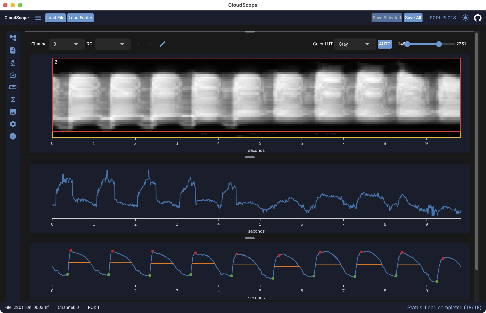
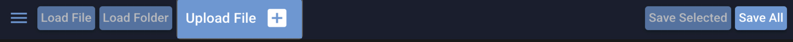
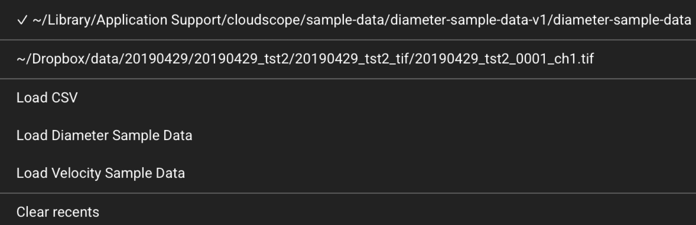
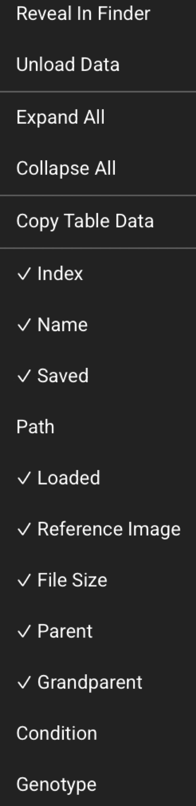

# Using the GUI

CloudScope provides a desktop and browser GUI for loading raw image files, visualizing image
data, selecting ROIs, and running supported analysis workflows. Current quantitative analysis
workflows are designed for line scan kymographs.

CloudScope is designed around a simple workflow: load data, visualize what you need, define or
select ROIs, run analysis, and review or export results. The desktop app and browser app share
the same interface.

CloudScope uses **image pyramids** for fast visualization at the zoom level on screen, while
analysis uses full-resolution source data. Image pixels and analysis
**load lazily** when you select a file or analysis, and can be unloaded from the file-list
context menu. Together, this lets you browse folders with many hundreds of files without loading
everything into memory at once.

{ .cs-screenshot .cs-screenshot-center width="560" loading=lazy }

**Main areas shown above:**

- **Left navigation toolbar** — icon column that opens side panels (file list, metadata, analyses, and settings).
- **Top header** — **CloudScope** title, history menu (:material-menu:{ .middle }), load/save controls, and theme/GitHub links.
- **File list** — collapsible acquisition tree at the top of the main workspace (full column set). The left-toolbar **File List** panel shows the same loaded data in a compact layout.
- **Primary image viewer** — kymograph display with ROI overlays; **image toolbar** sits above it.
- **Analysis plot** — velocity or diameter trace for the current selection.
- **Peak detection plot** — df/f0, derivative, and peak markers when peak detection applies.
- **Pool plots** — optional right-side panel ([Pool plots](pool-plots.md)) for folder-wide velocity and peak comparisons; open with **Pool Plots** in the top header.

## Getting started with sample data

The fastest way to explore CloudScope is to load example data from the
[`cloudscope-data`](https://github.com/mapmanager/cloudscope-data){target="_blank" rel="noopener"}
repository. Open the **history menu** (:material-menu:{ .middle }) in the load/save controls and choose:

| Menu item | Sample content |
|---|---|
| **Load Velocity Sample Data** | OIR kymograph data for velocity analysis demos |
| **Load Diameter Sample Data** | TIFF kymograph data for diameter analysis demos |

CloudScope downloads the archive on first use, verifies it, and caches it locally. The loaded
folder appears in the file list like any other folder load.

Sample data is the recommended first step when trying the application, confirming a fresh
installation, or working through the [end-user recipes](recipes/index.md).

## Top header and load/save controls

The top header spans the full width of the application. It shows the **CloudScope** title on
the left, load and save controls in the center, and theme / GitHub links on the right.

Load and save behavior differs slightly between the desktop app and the browser app:

=== "Desktop app"

    { .cs-screenshot .cs-screenshot-center width="520" loading=lazy }

    - **Load File** — open one supported image file from your computer (native file picker).
    - **Load Folder** — open a folder and load supported image files within it (native file picker).
    - **Upload File** is not shown; the desktop app reads files directly from disk.

=== "Web app"

    { .cs-screenshot .cs-screenshot-center width="520" loading=lazy }

    - **Load File** and **Load Folder** are disabled. Browsers cannot open arbitrary local paths
      the way the desktop app can. Hover the disabled buttons to see:
      *Local file picker is available in the desktop app*.
    - **Upload File** — upload one supported image file from your computer. You can also drop a
      file onto the upload control.

### History menu (:material-menu:{ .middle })

{ .cs-screenshot width="220" align=left loading=lazy }

Click the **history menu** button (:material-menu:{ .middle }) to the left of the load buttons.
Menu contents appear in this order:

1. **Recent folders** — one entry per recently opened folder. A check mark (✓) marks the path
   that matches the current session's last loaded folder. Click an entry to reload that folder.
2. **Recent files** — one entry per recently opened file (including CSV paths opened as files).
   A check mark marks the current last-loaded file when applicable.
3. **Load CSV** — open a CSV file from disk (desktop) or from upload context (web). Used when
   working with tabular outputs outside the normal image load flow, and to load a **randomized
   file manifest** that samples a subset of a large dataset. See
   [Generating a randomized file subset](../notebooks/generating-randomized-file-for-analysis.ipynb)
   and [Blinded analysis mode](blinded-mode.md).
4. **Load Diameter Sample Data** — download and open the diameter-analysis sample dataset from
   [`cloudscope-data`](https://github.com/mapmanager/cloudscope-data){target="_blank" rel="noopener"}.
5. **Load Velocity Sample Data** — download and open the velocity-analysis sample dataset from
   [`cloudscope-data`](https://github.com/mapmanager/cloudscope-data){target="_blank" rel="noopener"}.
6. **Clear recents** — remove all entries from the recent folders and recent files lists (shown
   when at least one recent path exists).

### Save buttons

On the right side of the load/save row:

- **Save Selected** — save the currently selected acquisition file when it has unsaved changes.
  Disabled when no file is selected or the selection has no pending changes.
- **Save All** — save every loaded file that has unsaved changes. Always available when files
  are loaded.

Saved files include a JSON state file and analysis CSV files next to each source image. See
[Saved file formats](saved-files.md) for a full description of what is written for metadata,
ROIs, and each analysis type.

## Left navigation toolbar

{ .cs-screenshot width="48" align=left loading=lazy }

The left navigation toolbar is a column of icons along the left edge of the window. Each icon
opens a panel in the left splitter area. Click an icon to open its panel; click the **same**
icon again to close the panel and return to the icon-only toolbar.

| Tooltip | What it does |
|---|---|
| **File List** | Compact acquisition tree for loaded files, channels, ROIs, and analyses. See [File list and acquisition tree](#file-list-and-acquisition-tree) below. |
| **Experimental Metadata** | Edit experiment metadata fields for the selected file. See [GUI: Experiment metadata](gui-experiment-metadata.md). |
| **Image Header** | View header fields from the file format and set physical units and axis labels. See [GUI: Image header](gui-image-header.md). |
| **Velocity** | Configure and run *in vivo* blood-flow velocity analysis. See [Analysis panels](#analysis-panels). |
| **Diameter** | Configure and run vessel diameter analysis. See [Analysis panels](#analysis-panels). |
| **Peak Detect** | Configure and run peak detection (for example GCaMP reporter fluorescence). See [Analysis panels](#analysis-panels). |
| **Reference Image** | View the reference or overview image when the file format provides one (for example Olympus `.oir` or Zeiss `.czi` line scan kymographs). When available, this panel can also show the **scan path** for the line scan. |
| **Config** | Application settings (text size, folder load depth, table font, auto-contrast percentiles, and **blinded analysis mode**). See [GUI: App config](gui-app-config.md) and [Blinded analysis mode](blinded-mode.md). |
| **App info** | Build and version information, log preview, and **Open Logs** for troubleshooting. |

## Pool plots

Click **Pool Plots** in the top header to open the right-side **pool plots** panel. Pool plots
aggregate *in vivo* velocity and peak-detection results across the **entire loaded folder**
and refresh automatically when you load files, run analyses, or edit metadata or ROIs.

See [Pool plots](pool-plots.md) for an overview, export actions, and example plots. Detailed
control documentation is coming soon.

## File list and acquisition tree

{ .cs-screenshot .cs-screenshot-center width="640" loading=lazy }

The **File list** at the top of the main workspace shows the full acquisition tree with the
default column set. Open the **File List** tab on the left toolbar for the same loaded data in a
compact panel (fewer columns visible by default; additional columns are available from the
context menu).

Selecting an item updates the rest of the interface. Linked views stay synchronized through
CloudScope's event system, so the image viewer, analysis panels, and result views follow the
current selection.

Typical use:

1. Load one or more files.
2. Select the file or channel you want to visualize.
3. Select an ROI or analysis result when available.
4. Use the analysis panels to run or update measurements.

### File list context menu

{ .cs-screenshot width="180" align=left loading=lazy }

Right-click the file list tree to open the context menu:

- **Reveal In Finder** — open the selected file's folder in the system file manager (the menu
  label follows macOS wording in the app today).
- **Unload Data** — free lazy-loaded image pixels and analysis for the selected file
  while keeping the file entry in the list.
- **Expand All** / **Collapse All** — expand or collapse all tree nodes.
- **Copy Table Data** — copy the visible tree rows to the clipboard.
- **Column toggles** (for example ✓ **Name**, **Loaded**, **Saved**, **Dims**) — show or hide
  file-list columns. Hidden schema columns remain available from this menu.

## Main image viewer

The primary image viewer displays the selected acquisition image, channel, and ROI overlays.
CloudScope uses image pyramids for fast visualization so the GUI can show only the resolution
needed for the current zoom level. Analysis still uses full-resolution source data.

## Image toolbar

{ .cs-screenshot .cs-screenshot-center width="520" loading=lazy }

The image toolbar sits above the primary image viewer.

**Channel and ROI**

- **Channel** — select the active image channel.
- **ROI** — select the active region of interest.
- **Add** (+) — add a new ROI.
- **Delete** (−) — delete the selected ROI.
- **Edit** — enter ROI edit mode in the image viewer.
- **Full width** / **Full height** — resize the ROI to span the full image width or height.
- **OK** / **Cancel** — submit or cancel an ROI edit.

**Contrast**

- **Color LUT** — colormap for the primary image display.
- **Auto** — set display contrast from percentile clipping on the current plane (uses the
  auto-contrast percentiles in [GUI: App config](gui-app-config.md)).
- **Min/max range slider** — manual display window; numeric labels show the current min and max
  values at each end of the slider.

Use this toolbar to adjust what is visible without changing the underlying acquisition data or
analysis results.

## Image context menu

{ .cs-screenshot width="130" align=right loading=lazy }

Right-click the primary image viewer to open the context menu:

- **ROIs** — show or hide ROI rectangle overlays on the image.
- **ROI Labels** — show or hide ROI labels (disabled while ROIs are hidden).
- **Traces** — show or hide analysis trace overlays on the image.
- **X Axis Labels** / **Y Axis Labels** — show or hide axis tick labels.
- **Square Plot** — toggle a square aspect ratio for the plot area.
- **Plotly Toolbar** — show or hide the Plotly mode bar.
- **Hover Info** — show or hide hover tooltips on the plot.
- **Copy To Clipboard** — copy the displayed plot image to the clipboard.

These controls affect how the image is displayed. They do not change the original data.

## Analysis panels

Open an analysis from the left navigation toolbar. Step-by-step workflows, screenshots, and
saved-file details live on the dedicated recipe pages:

| Left toolbar | Recipe |
|---|---|
| **Velocity** | [*In vivo* velocity analysis](recipes/velocity-analysis.md) — Radon-transform blood-flow velocity; velocity event analysis is in the same panel |
| **Diameter** | [Diameter analysis](recipes/diameter-analysis.md) — vessel diameter from line scan kymographs |
| **Peak Detect** | [Peak detection](recipes/sum-intensity-analysis.md) — functional fluorescence reporters (like GCaMP) |

Derived analyses that require velocity results first:

- [Velocity event analysis](recipes/analyses-from-velocity/velocity-event-analysis.md)
- [Heart rate analysis](recipes/analyses-from-velocity/heart-rate-analysis.md) (notebook today)
