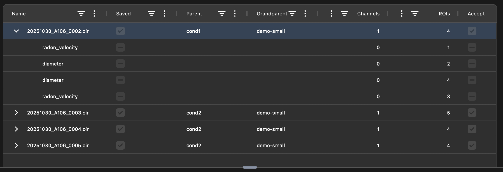
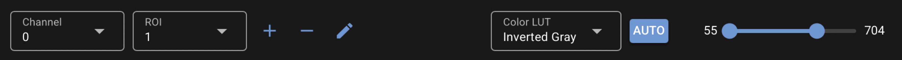
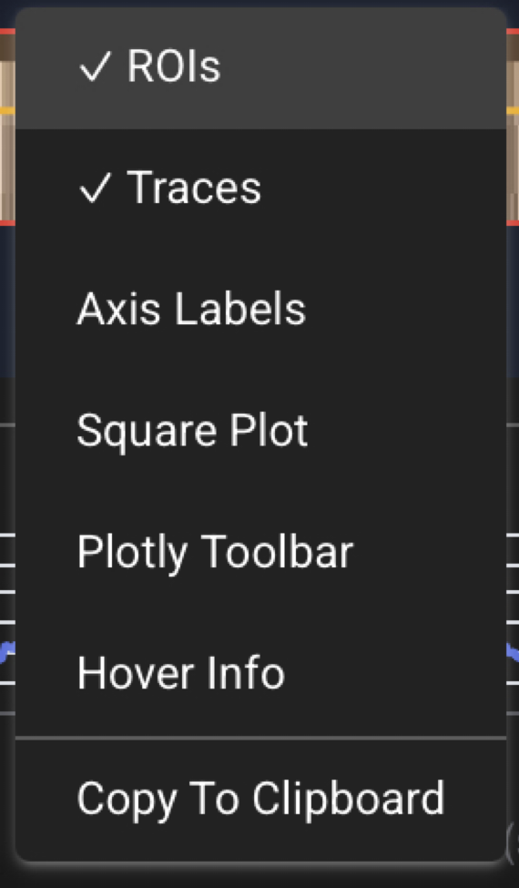
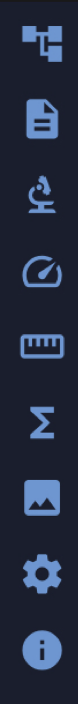
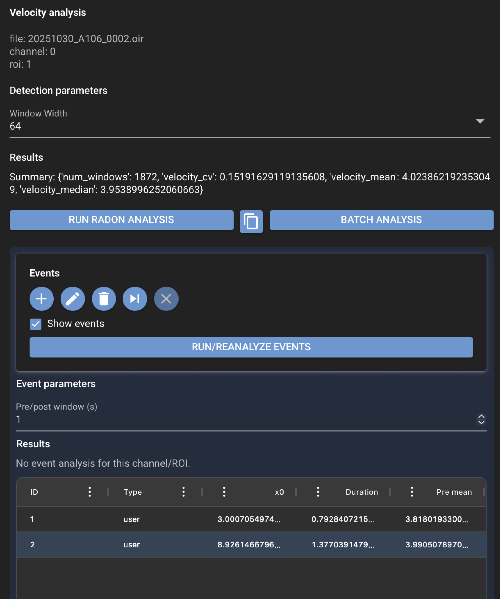

# Using the GUI

CloudScope provides a desktop and browser GUI for loading scientific image files, inspecting image data, selecting ROIs, and running supported analysis workflows. Current quantitative analysis workflows are designed for line scan kymographs.

CloudScope is designed around a simple workflow: load data, choose what to view, define or select ROIs, run analysis, and inspect or export results. The desktop app and browser app use the same interface and the same `acqstore` scientific backend.

## Main toolbar

{ .cs-screenshot .cs-screenshot-center width="760" loading=lazy }

The main toolbar is the starting point for loading and saving work.

- **Load** opens acquisition files or folders from disk.
- **Save** writes CloudScope sidecar files and analysis results for the current data.
- **View controls** help switch between the main image display, linked panels, and available analysis views.

Use the toolbar first when starting a new session, loading additional data, or saving results after analysis.

## File list and acquisition tree

{ .cs-screenshot .cs-screenshot-center width="900" loading=lazy }

The file list shows loaded acquisition files and their available channels, ROIs, and analysis entries. Selecting an item updates the rest of the interface. Linked views stay synchronized through CloudScope's MVC event system, so the image viewer, analysis panels, and result views follow the current selection.

Typical use:

1. Load one or more files.
2. Select the file or channel you want to inspect.
3. Select an ROI or analysis result when available.
4. Use the analysis panels to run or update measurements.

## Main image viewer

The primary image viewer displays the selected acquisition image, channel, and ROI overlays. CloudScope uses image pyramids for fast visualization so the GUI can show only the resolution needed for the current zoom level. Backend analysis still uses full-resolution data from `acqstore`.

## Image toolbar

{ .cs-screenshot .cs-screenshot-center width="760" loading=lazy }

The image toolbar controls common display actions for the image viewer. Depending on the current selection, these controls may include display, zoom, ROI, contrast, and overlay actions.

Use this toolbar to adjust what is visible without changing the underlying acquisition data or analysis results.

## Image context menu

{ .cs-screenshot width="150" align=right loading=lazy }

Right-click the primary image viewer to open the context menu. The context menu provides quick access to display and export actions for the current image view.

Common actions include:

- copying the displayed plot image,
- showing or hiding the Plotly toolbar,
- showing or hiding ROI overlays,
- showing or hiding analysis traces,
- showing or hiding axis labels.

These controls affect how the image is displayed. They do not change the original data.

## Left navigation toolbar

{ .cs-screenshot width="56" align=left loading=lazy }

The left navigation toolbar switches between major CloudScope views and workflows. Each icon opens a focused panel such as home, loading, metadata, ROIs, velocity analysis, diameter analysis, sum intensity analysis, or other analysis/result views.

The exact set of icons may change as CloudScope grows, but the purpose remains the same: choose the workflow panel, then use the main viewer and file list to work with the selected acquisition data.

## Velocity analysis panel

{ .cs-screenshot .cs-screenshot-center width="980" loading=lazy }

The velocity analysis panel is used to configure and run velocity analysis on the selected acquisition, channel, and ROI. The panel exposes scientific detection parameters and execution controls in the GUI, while the analysis itself is performed by the same backend code available to Python scripts and notebooks.

A typical velocity workflow is:

1. Select an acquisition, channel, and ROI.
2. Review or adjust analysis parameters.
3. Run the analysis.
4. Inspect plotted results and table output.
5. Copy or save results for downstream use.

See [Velocity analysis](recipes/velocity-analysis.md) for a step-by-step recipe.

Velocity, diameter, and sum intensity analyses use multiprocessing or multithreading where available. This can reduce analysis time in the GUI and in scripted workflows without changing the scientific API used to run the analysis.

## Sum intensity analysis panel

{ .cs-screenshot .cs-screenshot-center width="980" loading=lazy }

The sum intensity analysis panel configures and runs peak detection on normalized line
intensity from a functional reporter (like GCaMP). The panel exposes detection presets,
preprocessing parameters, and peak-detection controls. The plot view shows df/f0, the
derivative trace, and onset and peak markers.

A typical sum intensity workflow is:

1. Select an acquisition, channel, and rectangular ROI.
2. Choose a detection preset or tune individual parameters.
3. Run the analysis.
4. Inspect plotted traces and event markers.
5. Save results for downstream use.

See [Sum intensity analysis](recipes/sum-intensity-analysis.md) for a step-by-step recipe.

## Loading sample data

CloudScope includes menu actions to load example data from the [`cloudscope-data`](https://github.com/mapmanager/cloudscope-data){target="_blank" rel="noopener"} repository. Sample data is useful for learning the GUI, testing installation, and reproducing examples from the documentation.

## Getting results

Analysis results can be inspected in CloudScope result views and copied or saved for downstream analysis. Because the GUI and scripting workflows use the same backend, results generated from the interface should match results generated from equivalent `acqstore` scripts using the same data, ROIs, and parameters.