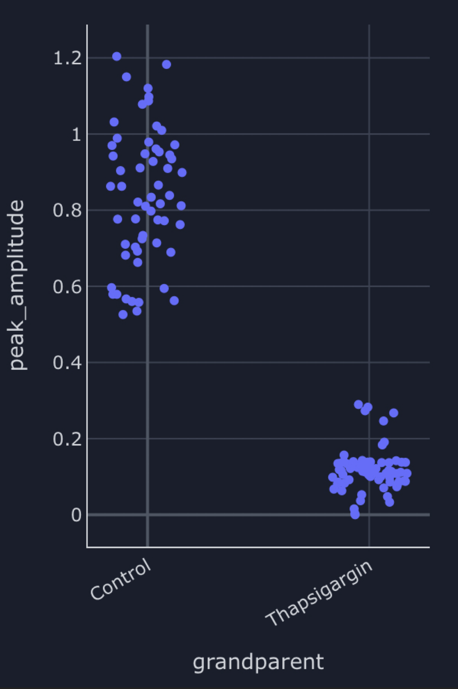
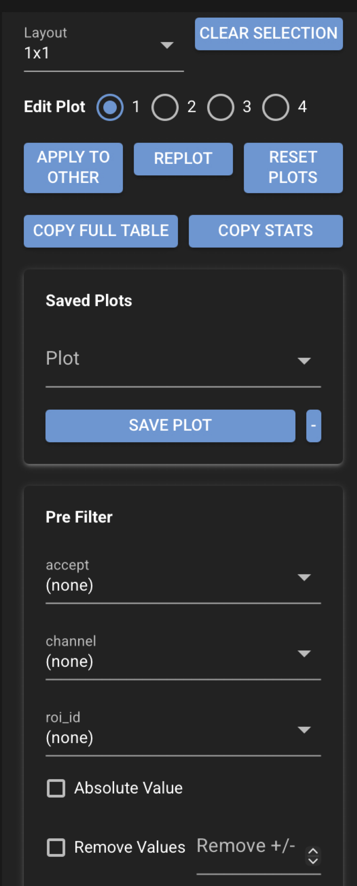
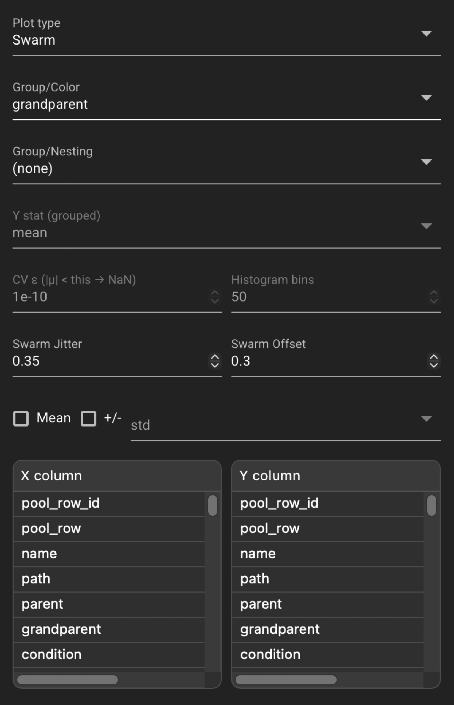

# Pool plots

Pool plots give you a **folder-wide view** of analysis results on the CloudScope Home page. While
the main viewer focuses on one file at a time, the pool panel aggregates rows from **every loaded
acquisition** in the current folder — *in vivo* velocity summaries on the **Velocity** tab and
sum-intensity peak events on the **Peaks** tab. You can filter, group, and chart those rows with
scatter, swarm, histogram, and other plot types to compare conditions (for example genotype or
treatment) without opening each file separately. The pool **updates in real time** as you load or
remove files, run or change analyses, edit ROIs, or update experiment metadata, so the chart
always reflects the folder you have open.

{ .cs-screenshot width="420" align=right loading=lazy }

The example above is a **swarm plot** of **peak_amplitude** from the **Peaks** pool, with points
grouped by **Genotype**. Each dot is one detected peak event from sum-intensity analysis across
the loaded folder; swarm spacing separates overlapping values within each genotype group.

**Click a point** in the pool plot to select the corresponding row in the pool table and sync
selection back to the **main GUI** (file list and primary views). Use **Copy full table** to copy
the entire pool for the active tab to the clipboard as tab-separated text — every row and column
currently in the pool, suitable for paste into a spreadsheet. Use **Copy stats** to copy an
organized summary of **precisely what the current plot is showing** (grouping, counts, and
statistics for the displayed values). Replot first if **Copy stats** reports that no summary is
available yet.

!!! info "Documentation coming soon"
    This page is a first-pass overview. Detailed documentation for every pool-plot control,
    preset, and plot type will be added in a future update.

## Open pool plots

On the CloudScope **Home** page, click **Pool Plots** in the top header to open or close the
pool panel on the right side of the window. The main image viewer and analysis plots stay on
the left; pool plots occupy the right splitter.

Desktop multi-window builds can also open a standalone pool window from the header **Open Pool**
control when that option is available.

## Velocity and Peaks tabs

The pool panel has two tabs:

| Tab | Data source |
|---|---|
| **Velocity** | One row per analyzed velocity result in the loaded folder (Radon velocity summaries and related columns). |
| **Peaks** | One row per detected sum-intensity peak event in the loaded folder. |

Switch tabs to change which analysis pool you are exploring. Each tab has its own plot layout,
filters, and export actions.

## Live folder-wide updates

Pool tables stay synchronized with the loaded folder. When you **load** or **remove** files,
**run** or **change** analyses, **edit** ROIs, or **update** experiment metadata, the
corresponding pool rows refresh automatically. You do not need to reopen the panel to pick up
new results after batch or single-file work.

## Left plot controls

The left column configures layout, plot type, filters, X/Y columns, grouping, and plot options.
Screenshots below show the top and middle sections; a bottom-section screenshot will be added
when available.

{ .cs-screenshot width="195" align=left loading=lazy }

{ .cs-screenshot width="195" align=left loading=lazy }

## See also

- [Using the GUI](gui.md) — Home page layout and **Pool Plots** header button
- [Velocity analysis](recipes/velocity-analysis.md)
- [Sum intensity analysis](recipes/sum-intensity-analysis.md)
- [Saved file formats](saved-files.md)
