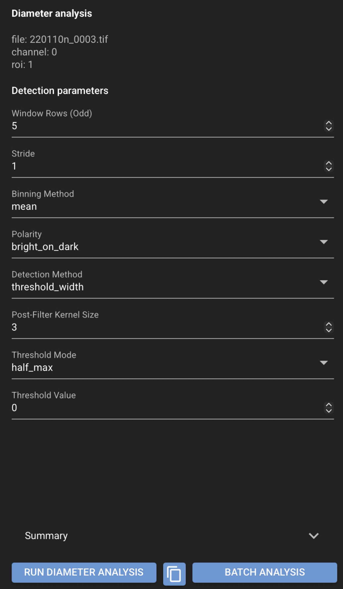

# Diameter analysis

Diameter analysis estimates **vessel diameter** from line scan kymographs.

## Before you start

- Load a **line scan kymograph**.
- Select or create an **ROI** covering the vessel region to analyze.

See [Using the GUI](../gui.md) for loading files and ROIs.

## Run diameter analysis in the GUI

1. Select the file, channel, and ROI in the file list.
2. Open the left navigation toolbar and click **Diameter** (straighten icon).
3. Review **Detection parameters** in the Diameter panel.
4. Run the analysis.
5. Review the summary, quality-control values, and tabular output.
6. Use **Save Selected** or **Save All** in the top header to persist results.

{ .cs-screenshot .cs-screenshot-center width="640" loading=lazy }

## Results and reproducibility

Review diameter results in the Diameter panel and the **Analysis plot**. Save from the top
header to write JSON and CSV files next to the source image.

The GUI and scripting workflows share the same `acqstore` backend, so results from the interface
should match equivalent Python scripts using the same data, ROIs, and parameters. See
[Saved file formats](../saved-files.md) for output file details.

## Saved files

For a source file named `my_file.tif`:

```text
my_file.tif.json
my_file.tif.diameter.csv
```

The JSON file stores detection parameters and summary values (for example mean diameter and
QC scores). The CSV stores tabular diameter results.

## See also

- [End-user recipes](index.md)
- [Diameter Analysis (Data Scientist)](../../scientists/diameter-analysis.md) — detection parameters and science detail
