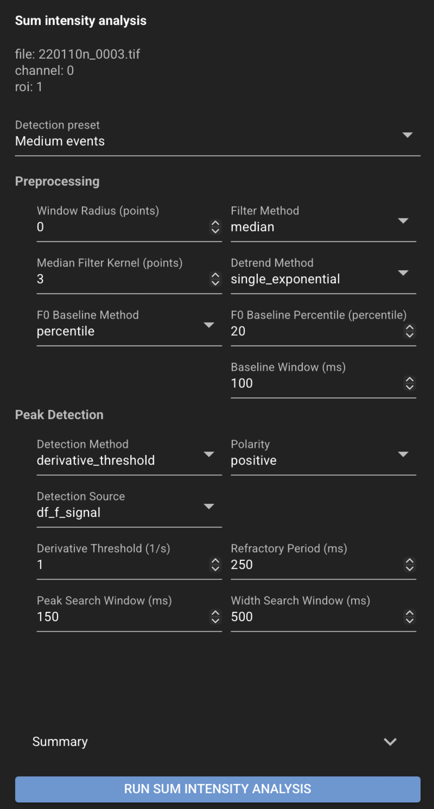

# Peak detection

Peak detection measures **normalized line intensity** along a line scan kymograph ROI
and detects transient peaks from a **functional reporter (like GCaMP)**. The analysis computes
delta-F over F0 (df/f0), applies derivative-threshold onset detection by default, and refines
peak locations in a search window around each onset.

In the CloudScope GUI this workflow is labeled **Peak Detect** on the left toolbar.

## Before you start

- Load a **line scan kymograph** (`.oir`, `.czi`, `.nd2`, `.tif`, or `.ome.zarr`).
- Select or create a **rectangular ROI** covering the region to analyze.

See [Using the GUI](../gui.md) for loading files and ROIs.

## Run peak detection in the GUI

1. Select the file, channel, and ROI in the file list.
2. Open the left navigation toolbar and click **Peak Detect** (functions icon).
3. Choose a **Detection preset** (**fast**, **medium**, or **slow**) or tune individual
   detection parameters.
4. Click **Run Sum Intensity Analysis**.
5. Review the plot: df/f0 trace, derivative, onset markers, and peak markers.
6. Use **Save Selected** or **Save All** in the [top header](../gui.md#top-header-and-loadsave-controls) to persist results.

{ .cs-screenshot .cs-screenshot-center width="640" loading=lazy }

Optional plot overlays (context menu on the peak-detection plot):

- Show or hide the **derivative** trace on the secondary y-axis.
- Show or hide a **diameter** trace when diameter analysis has been run on the same file,
  channel, and ROI (default off).

## Results

Review peak-detection results in the **Peak Detect** panel and the **Peak detection plot** at
the bottom of the Home page. Save from the top header to write JSON and CSV files next to the
source image. See [Saved file formats](../saved-files.md) for output file details.

## Saved files

For a source file named `my_file.tif`:

```text
my_file.tif.json
my_file.tif.sum_intensity.csv
```

The JSON file stores detection parameters, summary values (for example peak count and F0
baseline), and event records. The CSV stores per-timepoint tabular traces and onset/peak
markers.

## See also

- [Pool plots](../pool-plots.md) — compare peak results across the loaded folder
- [End-user recipes](index.md)
- [Sum Intensity Analysis (Data Scientist)](../../scientists/sum-intensity-analysis.md) — detection parameters, presets, and science detail
- [Sum Intensity Analysis Notebook](../../notebooks/sum-intensity-analysis.ipynb) — scripted workflow
